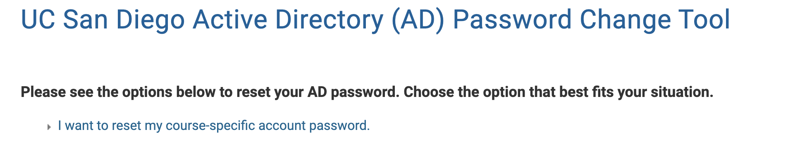
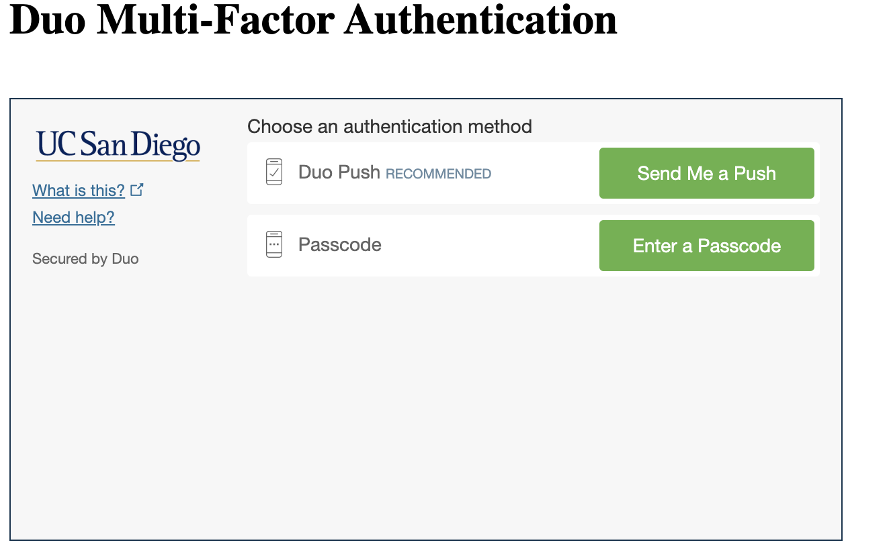
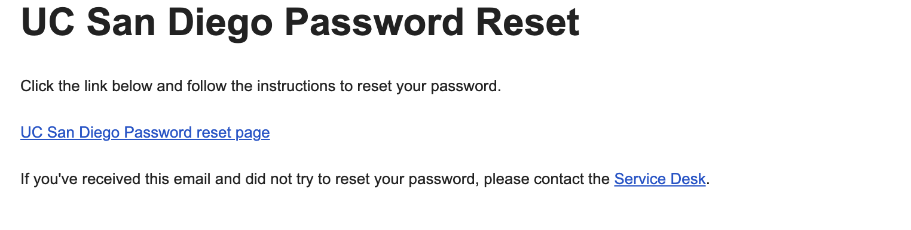

# Lab Report 1 - Brooks Ephraim

## Step 1: Logging into course specific `eing6` account
Steps:
1. Go to [Link](https://sdacs.ucsd.edu/~icc/index.php)
2. 
Type in UCSD account information and click Submit
3. 
Click the button that says csl15sp23zz (zz will be replaced by a unique pair of letters)
4. 
Copy the words in **bold** and click *Use Global Password Change Tool*
5. 
Click *Proceed to the Password Change Tool*
6. 
Click in the `text box` and paste your username and click **Continue**
7. 
Click *I want to reset my course-specific account password.*
8.
Confirm Duo Authentication
9. 
You will get an email. Click *UC San Diego Password reset page*
10. 
Enter new password information and click **Change Password**. You have now changed your course-specific account password!

## Step 2: Downloading and opening VS Code
Steps:
1. Go to [Link](https://code.visualstudio.com/)
> I am unable to provide steps for the rest of the process to download VS Code, as I already had it downloaded and functioning prior to the lab, and therefore did not complete any subsequent steps in the lab.

## Step 3: Remotely Connecting
Steps:
1. ![Image].(lab1image10)
Open a new terminal in VS Code
2. In the terminal, type *ssh cs15lsp23zz@ieng6.ucsd.edu* where zz is a unique pair of letters associated to your course specifc account and then type in your password that you just set for this account.
3. ![Image].(lab1image11)
> I am unable to provide steps for the rest of this process, as I was one of the students who was never able to access my account. TA gave permission to include this screenshot and explanation
