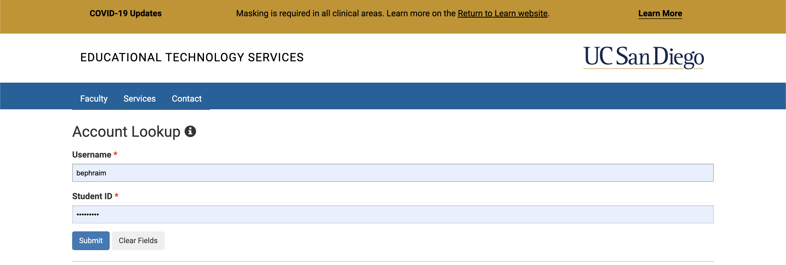
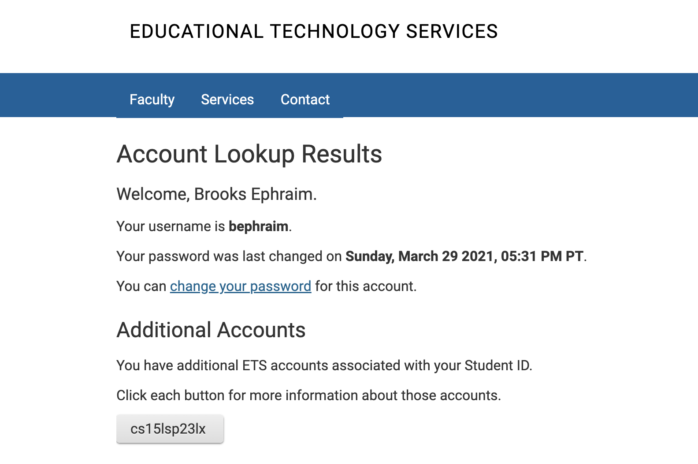
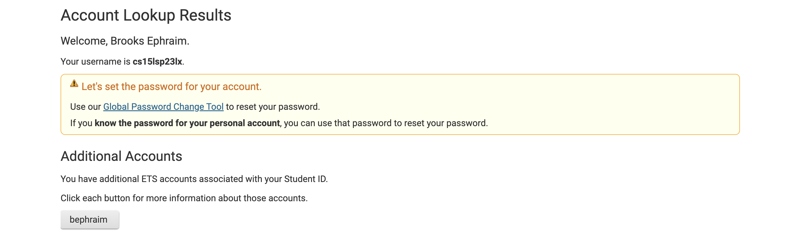
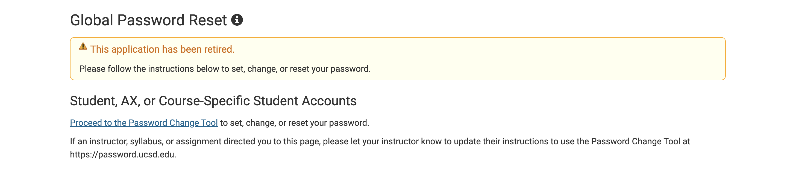
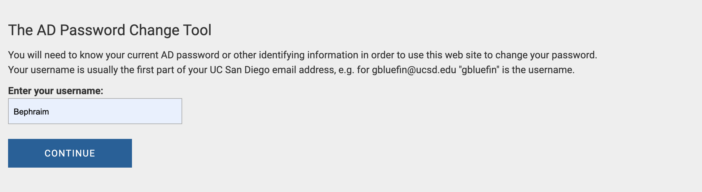

# Lab Report 1 - Brooks Ephraim

## Step 1: Logging into course specific `eing6` account
Steps:
1. Go to [Link](https://sdacs.ucsd.edu/~icc/index.php)
2. 
Type in UCSD account information and click Submit
3. 
Click the button that says csl15sp23zz (zz will be replaced by a unique pair of letters)
4. 
Copy the words in **bold** and click *Use Global Password Change Tool*
5. 
Click *Proceed to the Password Change Tool*
6. 
Click in the `text box` and paste your username and click **Continue**
7. ()
Click *I want to reset my course-specific account password.*
8.()
Confirm Duo Authentication
9. ()
You will get an email. Click *UC San Diego Password reset page*
10. ()
Enter new password information and click **Change Password**
