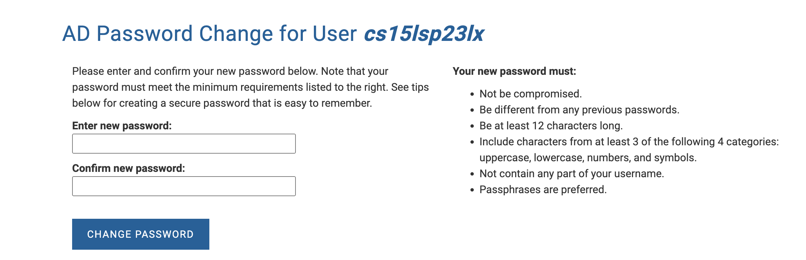
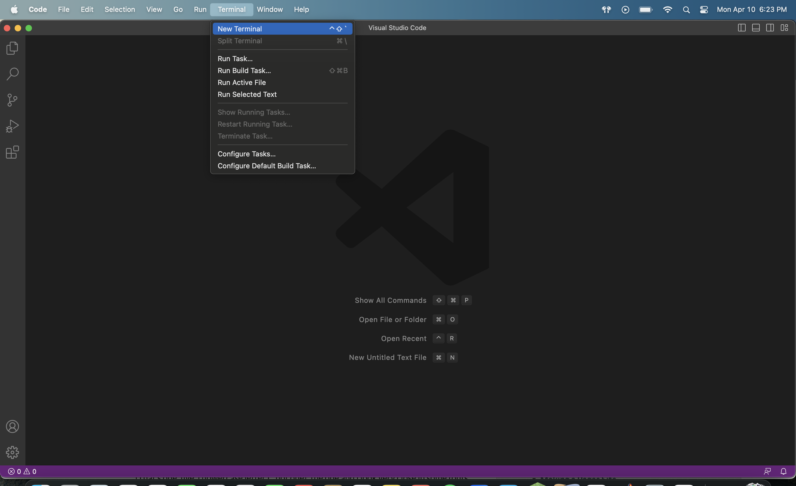
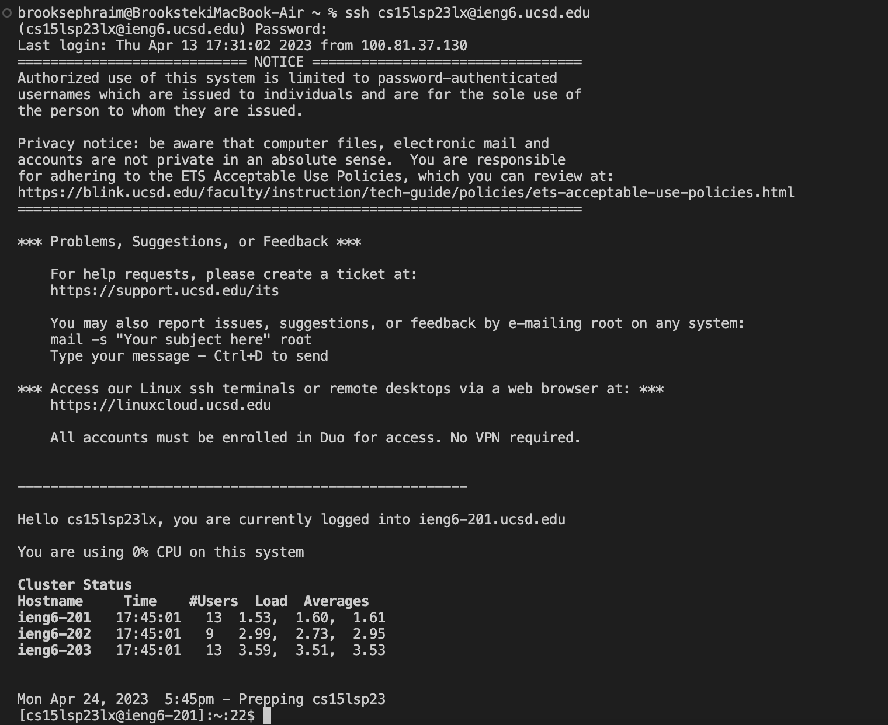
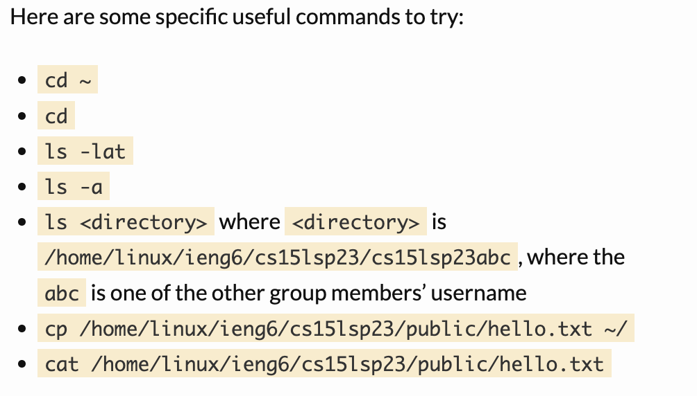
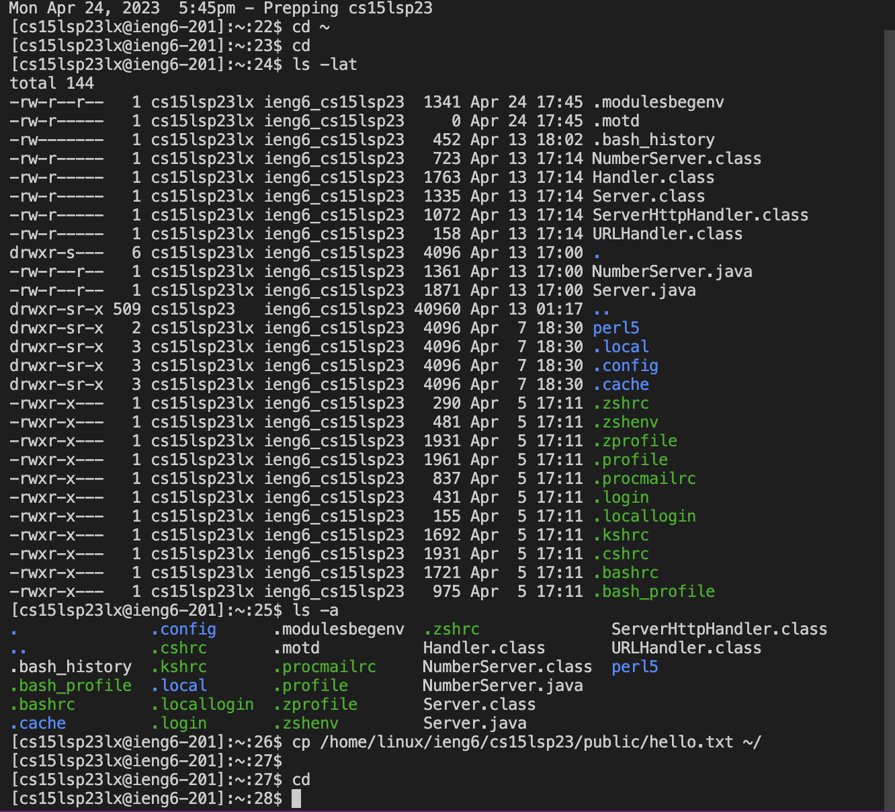
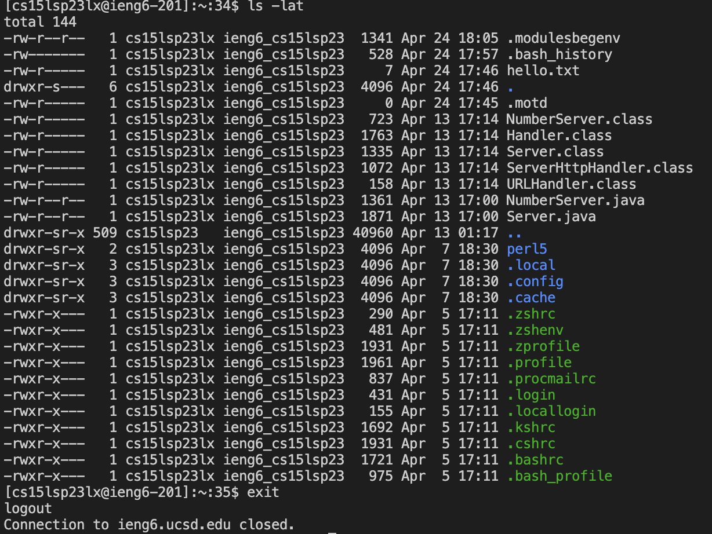

# Lab Report 1 - Brooks Ephraim

## Step 1: Logging into course specific `ieng6` account
Steps:
1. Go to [Link](https://sdacs.ucsd.edu/~icc/index.php)
2. 
Type in UCSD account information and click Submit
3. 
Click the button that says csl15sp23zz (zz will be replaced by a unique pair of letters)
4. 
Copy the words in **bold** and click *Use Global Password Change Tool*
5. 
Click *Proceed to the Password Change Tool*
6. 
Click in the `text box` and paste your username and click **Continue**
7. 
Click *I want to reset my course-specific account password.*
8.
Confirm Duo Authentication
9. 
You will get an email. Click *UC San Diego Password reset page*
10. 
Enter new password information and click **Change Password**. You have now changed your course-specific account password!

## Step 2: Downloading and opening VS Code
Steps:
1. Go to [Link](https://code.visualstudio.com/)
> I am unable to provide steps for the rest of the process to download VS Code, as I already had it downloaded and functioning prior to the lab, and therefore did not complete any subsequent steps in the lab.

## Step 3: Remotely Connecting
Steps:
1. 
Open a new terminal in VS Code
2. In the terminal, type *ssh cs15lsp23zz@ieng6.ucsd.edu* where zz is a unique pair of letters associated to your course specifc account and then type in your password that you just set for this account.
3. 
If you see output in the terminal that looks similar to the above image, then you have successfully remotely connected into your course specific account!

## Step 4: Trying Some Commands
Steps:
1. 
These are a list of common commands to try in the terminal.
2. 
Attached is the input and output of some commands in the terminal. For example, **cd ~** changes the terminal to the home directory. Additionally, **ls - lat** lists the files and directories.
3. 
In order to exit you can *CTRL-D* or run the command **exit**
