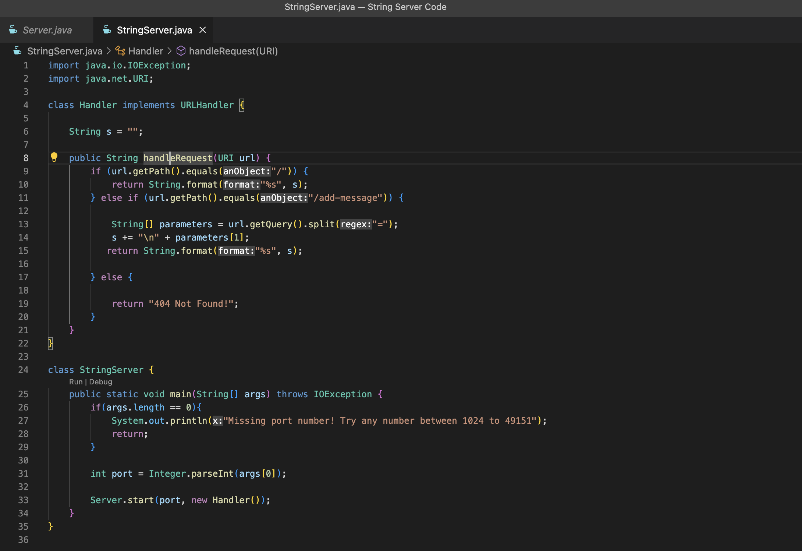
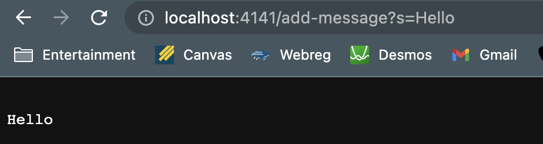
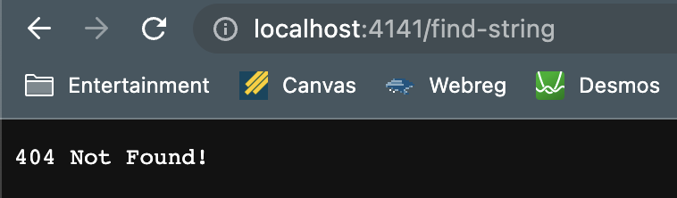
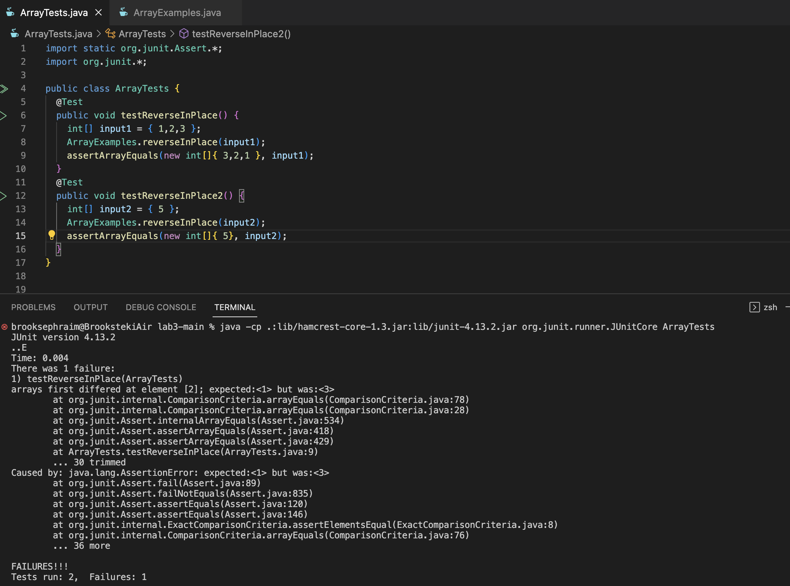

# Lab Report 2

## Part 1: StringServer 

Below is a screenshot of the code for StringServer:


The following image shows a use of /add-message. After input, the url reads: 
> http://localhost:4141/add-message?s=Hello



The input above uses the method: getPath() on the URI paramter *url*, which retries the path(which is the input) of URL into a string. It then uses the .equals() method of the String class, with the argument "/add-message" to determine if the given path is what we're looking for. getQuery() is also used to get the string that is added to the output on the page by finding the string that is after the equal sign (which is done by using split("=")). The string that is found from this process is added to "s", which is the varaible name for the string that represents the entirety of the output and updates with a new line everytime the "/add-message" command is run. Finally, String.format() properly formats the input in the uri to a string that is properly displayed on the page with the parameters "$s", which properly formats a string, and "s".

The follow image shows an invalid command in the URI line:


The input from the screenshot uses getPath() to retrieve the path of the URI into a string. It then uses .equals() (with the paramter "/add-message" to determine of the write command is used. An inconsistency is found, resulting in the code returning the error message: "*404 Error Not Found!*". The string that holds all of the inputs does not get updated when this happens.

## Part 2: Debugging

This debugging will be for *reverseInPlace()* method within the **ArrayExamples.java** file.

* Failure inducing input:
```
#Failure Inducing Code
static void reverseInPlace(int[] arr) {
    for(int i = 0; i < arr.length; i += 1) {
      arr[i] = arr[arr.length - i - 1];
    }
  }
 #JUnit
 @Test 
	public void testReverseInPlace() {
    int[] input1 = {1,2,3};
    ArrayExamples.reverseInPlace(input1);
    assertArrayEquals(new int[]{3,2,1}, input1);
	}
  ```
  * Input that doesn't induce a failure
  ```
  #Passing Code
static void reverseInPlace(int[] arr) {
    for(int i = 0; i < arr.length; i += 1) {
      arr[i] = arr[arr.length - i - 1];
    }
  }
 #JUnit
 @Test 
	public void testReverseInPlace() {
    int[] input2 = {5};
    ArrayExamples.reverseInPlace(input2);
    assertArrayEquals(new int[]{5}, input2);
   ```
  * Symptom, as output of running tests:
  
  * Bug as Before-and-After code:
  ```
  #Before code
  static void reverseInPlace(int[] arr) {
    for(int i = 0; i < arr.length; i += 1) {
      arr[i] = arr[arr.length - i - 1];
    }
  }
  #After code
  static void reverseInPlace(int[] arr) {
    for(int i = 0; i < arr.length/2; i += 1) {
      int temp = arr[i];
      arr[i] = arr[arr.length - i - 1];
      arr[arr.length - i - 1] = temp;
    }
  }
  ```
  
  The issue with the original code was that the for loop continued for far too long. It kept going such that it replaced later items in the list with already replaced items from earlier in the list, meaning the list was incorrectly reversed. These edits allow it such that it stops at the half-way point of the list, so no items are erroneously changed. By adding a temp variable, all items are properly placed in the correct, reversed order. 
  
  
 ## Part 3: What I learned
 
 I would say that I learned the most from Lab 2. URL's are such a common thing for those who actively use the internet, so it is very easy to overlook all the tiny attributes that go into websites. I learned about all the aspects of an URL link and how to properly read them and understand what they mean. I also learned a lot about servers. I've heard the term before and knew that it had to do something with a remotely running computer, but Lab 2 taught me a lot more about the specific about how servers are ran and where they are located and who can access it. I learned what a localhost was and how different ways are needed to access a server, depending on if it trying to be accessed from the local host or elsewhere. Furthermore, something I learned that I didn't know before was how to connect a server to a remote computer, and how convenient and power of connecting to and having access of remote computers. The coolest thing about this lab was definetely starting our own servers. It was very stimulating to see how relatively easy it is to create what can effectively be classified as a fully funcitoning webpage (with obvious limitations). 


