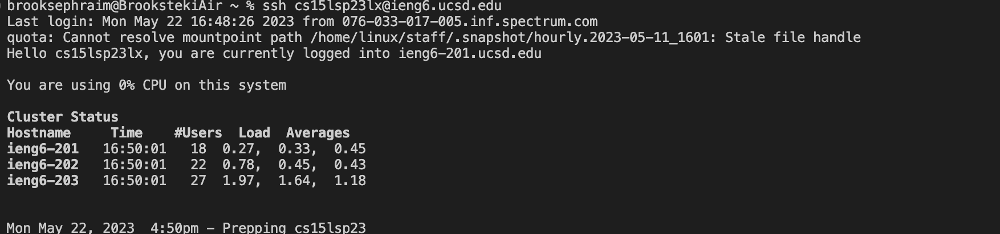
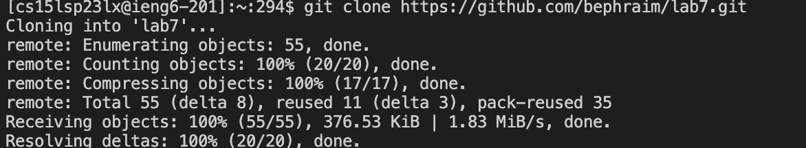
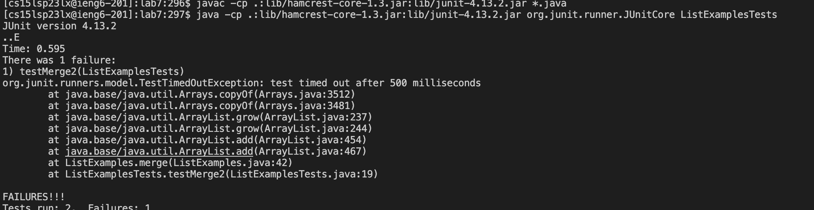
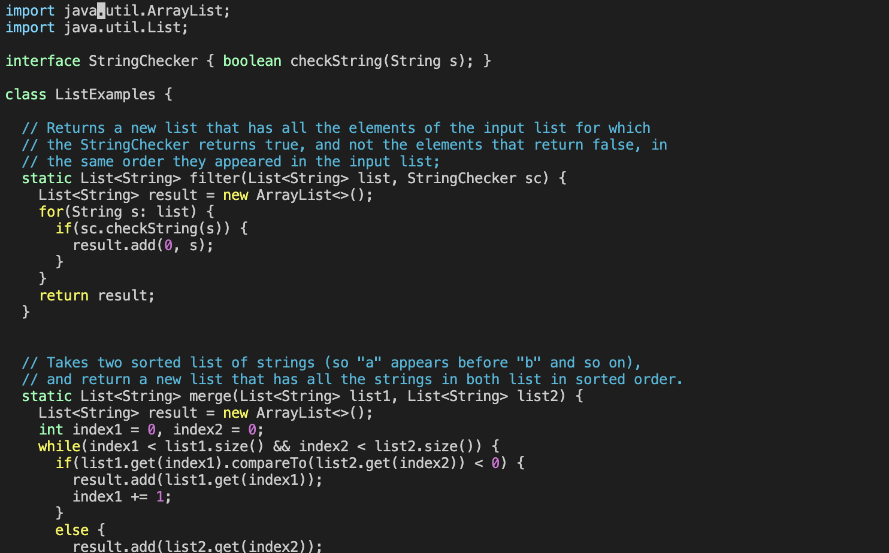
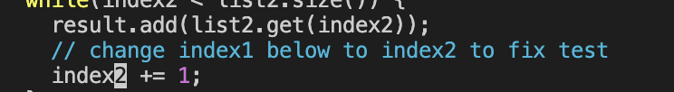
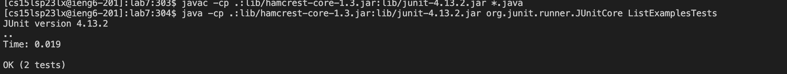
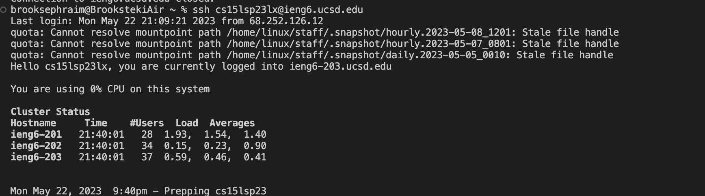
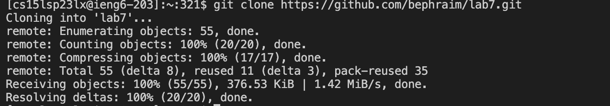

# Lab Report 4

## Baseline

**Time:** 3 minutes, 43 seconds



*Keys Pressed:* 
All I had to do was type in `ssh cs15lsp23lx@ieng6.ucsd.edu`. 
No password since I configured  it to automatically sign me in



*Keys Pressed:* I typed `git clone` and then copied the git repository link from my repositories on GitHub.



*Keys Pressed:* I had to copy and paste the `javac` and `java` commands for the first time, but now I can access them with the `<Up>` key. The image shows that the tests failed.



*Keys Pressed:* After typing in `Vim ListExamples.java` (I pressed `<Tab>` twice after typing "L" to autofill), this menu popped up



*Keys Pressed:* I pressed the `<K>` key several times to get down to the correct line, then typed `r``2` to get the correct line.


*Keys Pressed:* I typed `:``w``q``!``<Enter>` to save and quit.



**Time:** 3 minutes, 43 seconds I clicked `<Up>` 3 times for the `javac` command and twice for the `java` command

## Streamlined 


**Time:** 1 minutes, 01 seconds



*Keys Pressed:* I had to type in the `ssh` command (No password



*Keys Pressed:* I pressed `<Up>` 8 times to get to the git clone command

```
All steps were the same as above
```


