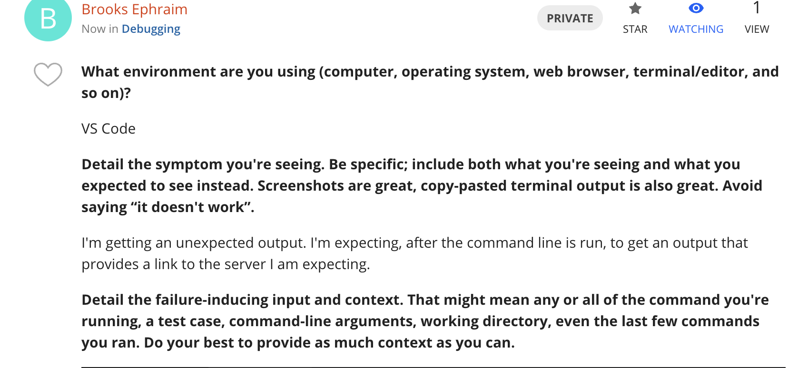
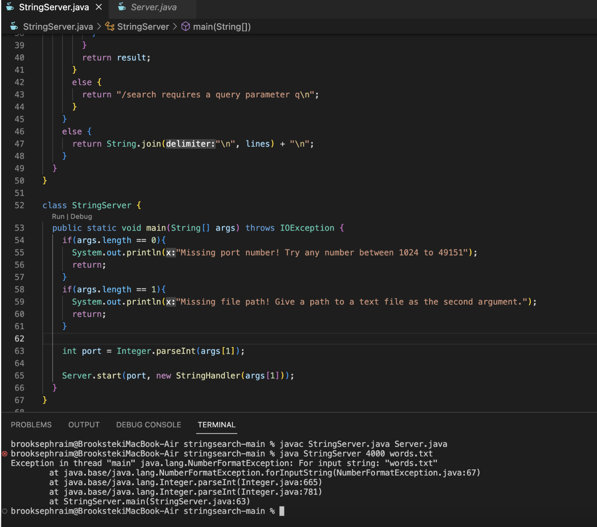
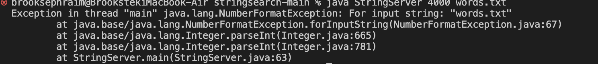
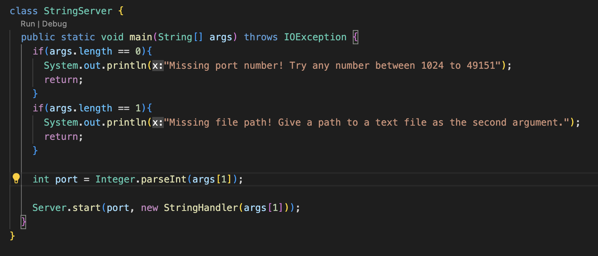
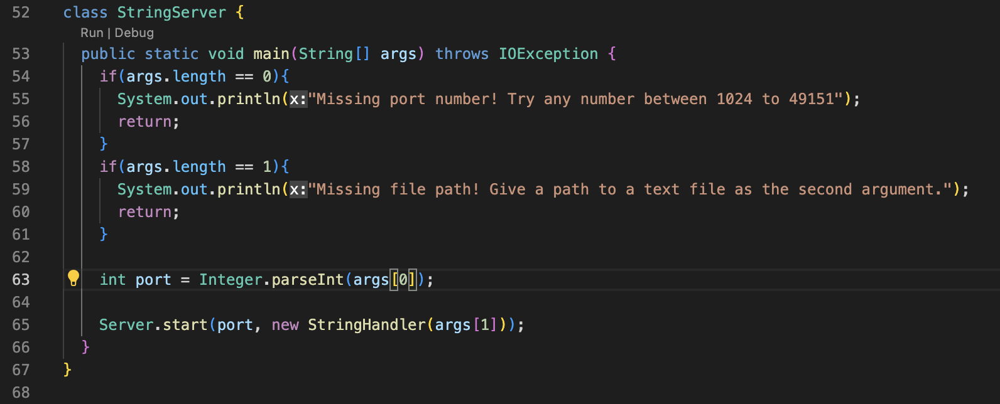
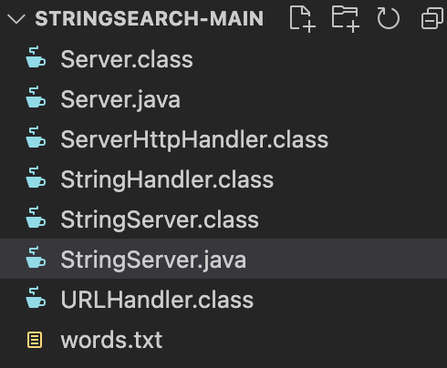
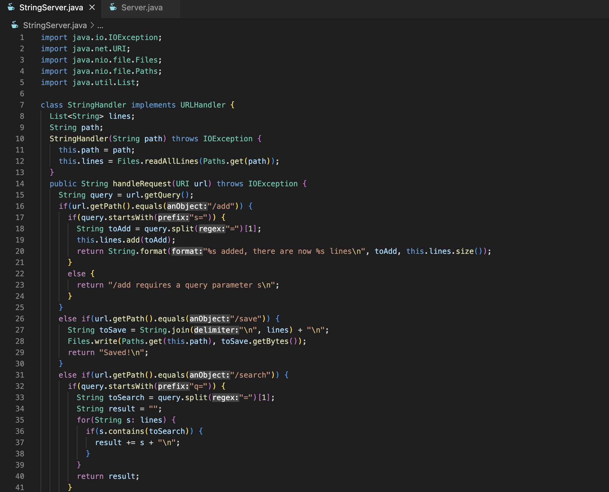
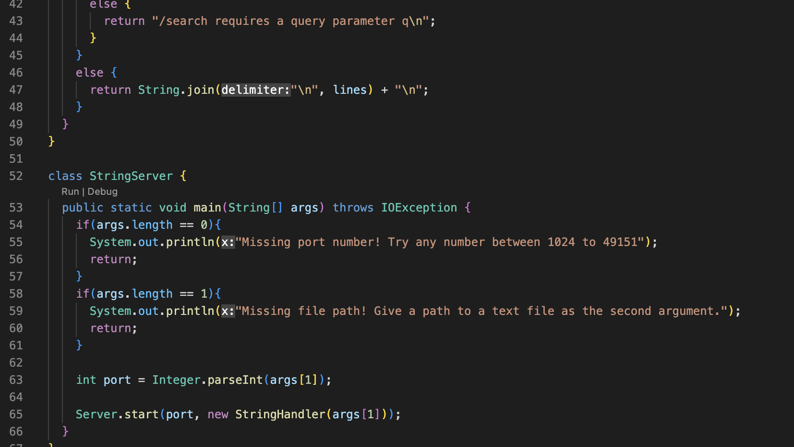
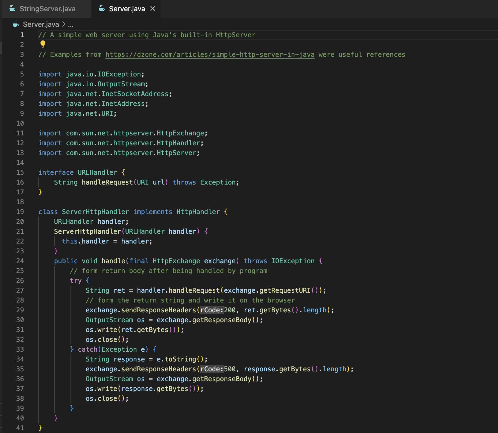
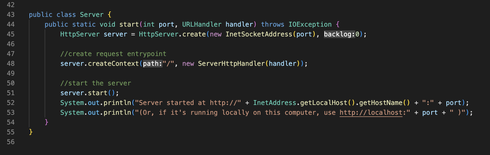

# Part 1 - Debugging Scenario

1. **Original debugging post**



> These screenshots show a hypothetical original post of a student confused about a bug in the StringServer class

2. **Response from a TA**
Response:
```
Hi! Thanks for your request. It seems like there is an issue with your command line arguments. Why don't you test each of the possibilites for your arguments to make sure you have everything covered and in the right position.
```

3. **Using TA feedback to determine the bug**


> This is testing behavior with 0 command line arguments. Output is as expected

> This is testing behavior with 1 command line argument. Output is as expected

> This is testing behavior with 2 command line arguments. Output is unexpected, this is where the bug is.

*Bug:* The bug is that when creating a new port, it needs to use the first command line argument (`args[0]`) instead of the second (`args[1]`). It tries to pass a .txt file when it is expecting something that can be parsed into an integer.


> This is exactly where the bug is.

>And this is what it looks like when it is fixed. Notice how the parameter on line 63 was changed to `args[0]` rather than it being `args[1]`.


> Finally, this is what the correct output for the given input is.

4. **Final Information**
**i).** The active directory for the file being worked on is: stringsearch-main/StringServer.java. This is what it looks like:


**ii).** The contents of the two relevant files prior to fixing are shown below:





**iii).** The command line that run the bug is shown below:


**iv).** The edit to fix the bug was done on line 63 of the StringServer.java file. The `args[1]` was changed to `args[0]`. This allows the new port input to be an integer (4000) rather than trying to inappropriately pass a text file through. After this change was made, the behavior was as expected.

